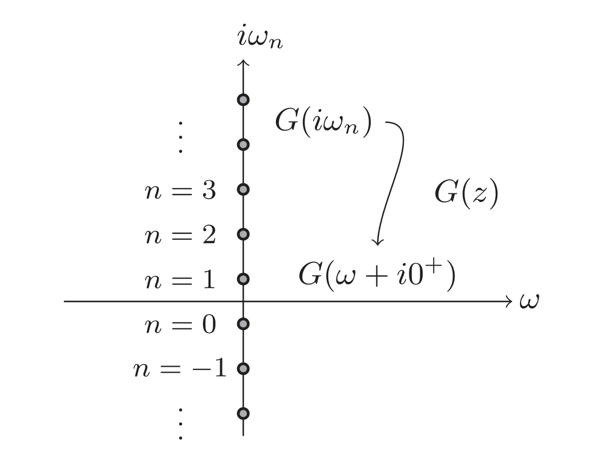

# pade

<h1 align="center">
  
</h1>

Computes the N-point [Pade approximant](https://en.wikipedia.org/wiki/Pad%C3%A9_approximant) of order [(N-1)//2, N//2] for a function in the complex plane. The Pade approximant interpolates a set of N points in the complex plane by the ratio of two polynomials. 

Unlike the Scipy.misc.pade method which computes the Pade approximant for a function given its Taylor series coefficients, this code finds the Pade approximant which interpolates a set of N points specified in the complex plane.

Useful for analytic continuation of complex functions from the imaginary axis onto the real axis such as for single particle response functions in condensed matter physics. The Pade approximant is perhaps the simplest approximation which can simulate the non-analyticies of functions in the complex plane.

Calculated following the algorithm provided in [H. J. Vidberg and J. W. Serene, J. Low Temp. Phys. 29,
179 (1977).](https://link.springer.com/article/10.1007%2FBF00655090)

Example:
```ruby
import pade

# fit the pade approximant at points 'zs' with values 'us'

p = pade.fit(zs, us)    

# evaluate the pade approximant at point 'z'

p(z)
```
